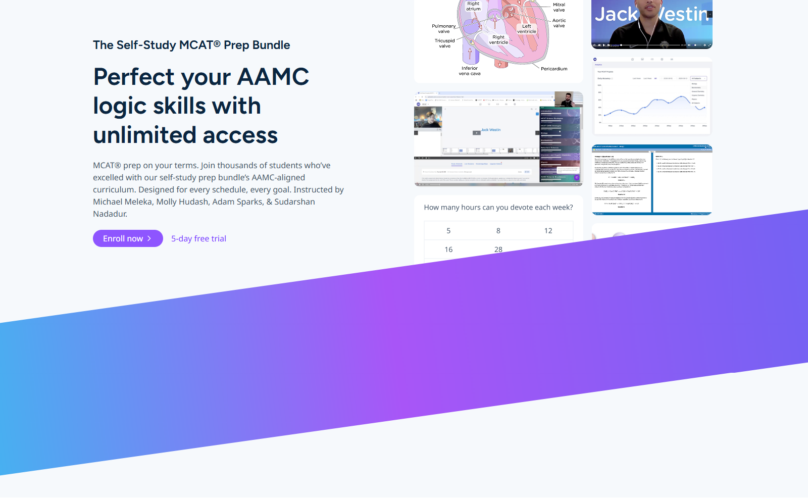

# Self-Paced Complete Course – Hero Section



This project is a fully responsive hero section built with **HTML**, **Tailwind CSS**, and **JavaScript**, based on a Figma design. It showcases the Self-Paced MCAT® Prep Bundle.

---

## 📐 Breakpoints

| Device   | Width Range |
|----------|-------------|
| Mobile   | 1–600px     |
| Tablet   | 601–900px   |
| Desktop  | 901+ px     |

---

## 🖋️ Fonts

- [Figtree (Weight 650)](https://fonts.google.com/specimen/Figtree)
- [Noto Sans](https://fonts.google.com/specimen/Noto+Sans)

---

## 🎨 Features

- ✅ Responsive layout (Mobile / Tablet / Desktop)
- ✅ Variable font weights
- ✅ Smooth animations for images
- ✅ Animated gradient stripe
- ✅ Custom styling using Tailwind CSS CDN

---

## 🚀 How to Use

1. Clone or download the project
2. Open `index.html` in your browser
3. Make sure your `assets/` folder is in the same directory

---

## 📁 Folder Structure

```
/project-root
├── index.html
├── style.css
├── assets/
│   ├── Heart.png
│   ├── Course.png
│   └── ...
└── preview.png
```

---

## 🧪 Notes

This layout was developed as part of a frontend audition task for a WordPress-based remote position. Tailwind CDN is used for simplicity and fast iteration.

---

**Developed by:** [Mohammed Abdelfattah](https://www.linkedin.com/in/m-abdelfattah92/)  
**GitHub:** [https://github.com/volmohammed1](https://github.com/volmohammed1)
